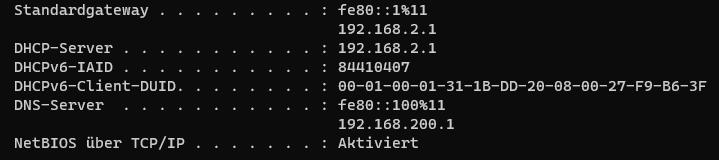

# Szenario 2 – Keine Netzwerkverbindung / kein Internetzugang

## Problemaufnahme
Ein Arbeitsplatz meldet fehlenden Internetzugang, obwohl die Netzwerkverbindung aktiv ist, andere Systeme sind nicht betroffen.
 
 

 

## Analyse
- IP-Konfiguration mittels ipconfig überprüft
- Erreichbarkeit externer IP-Adressen getestet
- DNS-Auflösung geprüft

 

## Ursache
Falsch konfigurierte DNS-Einstellungen am Client.

 

## Lösung
- Korrektur der DNS-Konfiguration
- Aktualisierung der Netzwerkeinstellungen

 

## Ergebnis
Internetverbindung und Domain-Namensauflösung funktionieren wieder einwandfrei.

 
 
 

### Testumgebung
- Betriebssystem: Windows 11 Pro (VM)
- Benutzerkonten: Lokaler Administrator (admin), Standardbenutzer (user01)
- Netzwerk: Standard LAN/WLAN (DHCP)
- Tools:
  - Windows Bordmittel (Ereignisanzeige, Dienste, Systemsteuerung)
  - Eingabeaufforderung / PowerShell
