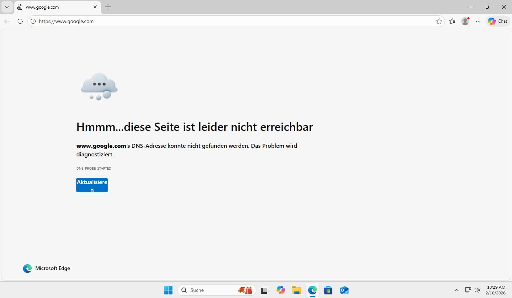

# Szenario 2 – Keine Netzwerkverbindung / kein Internetzugang

## Ausgangslage
Ein Arbeitsplatz meldet fehlenden Internetzugang, obwohl die Netzwerkverbindung aktiv ist, andere Systeme sind nicht betroffen.
 
 

 

## Analyse
- IP-Konfiguration mittels ipconfig überprüft
- Erreichbarkeit externer IP-Adressen getestet
- DNS-Auflösung geprüft

 

## Ursache
Falsch konfigurierte DNS-Einstellungen am Client.

 

## Lösung
- Korrektur der DNS-Konfiguration
- Aktualisierung der Netzwerkeinstellungen

 

## Ergebnis
Internetverbindung und Namensauflösung funktionieren wieder einwandfrei.

 

## Fazit
Systematische Netzwerkdiagnose ermöglicht eine schnelle Eingrenzung der Fehlerursache.

