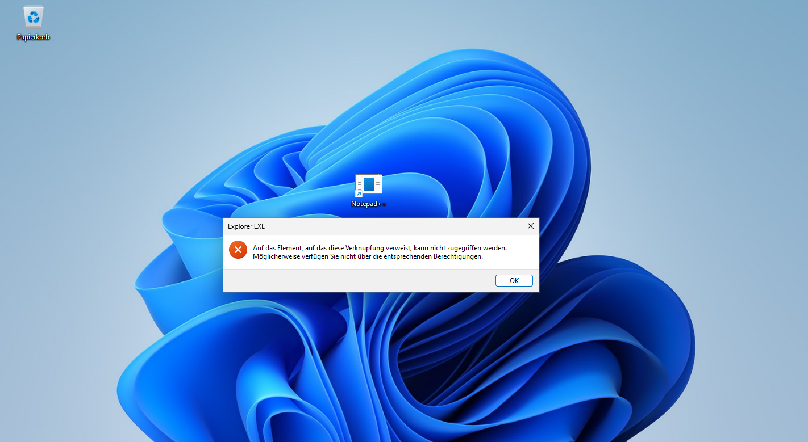

# Szenario 3 – Software startet nicht nach Installation

## Problemaufnahme
Ein Benutzer meldet, dass eine installierte Anwendung nicht gestartet werden kann.

 

## Analyse
- Auswertung der Ereignisanzeige
- Prüfung der Installationsart und des Installationspfads

 

## Ursache
Die Software wurde nur benutzerspezifisch und nicht für alle Profile nstalliert.

 

## Lösung
- Deinstallation der Anwendung
- Neuinstallation im richtigen Verzeichnis für alle Benutzer

 
  
## Ergebnis
Die Anwendung kann von allen Benutzern fehlerfrei gestartet werden.

 

## Fazit
Korrekte Softwareinstallation und Rechtevergabe sind essenziell für einen stabilen Systembetrieb.

