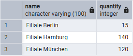

# Szenario 02 – Analyse einer Umsatzabweichung

## Problemaufnahme
Die Filiale Berlin meldete am 10.02.2026 einen deutlich zu niedrigen Tagesumsatz im Vergleich zu den Vortagen.

 

## Analyse
Zunächst wurde der Tagesumsatz aller Filialen verglichen, um die Abweichung einzugrenzen. Dabei zeigte sich, dass ausschließlich Berlin auffällig war.

Im nächsten Schritt wurden die einzelnen Produktverkäufe der betroffenen Filiale analysiert. Ein Produkt wies eine ungewöhnlich geringe Verkaufsmenge auf.

Ein Vergleich mit anderen Filialen bestätigte die Abweichung.

 

## Ursache
Im Datensatz war für das Produkt eine fehlerhafte Verkaufsmenge hinterlegt (15 statt 150).  
Die Ursache deutet auf einen Import- oder Erfassungsfehler hin.

 

## Maßnahme
Die fehlerhafte Mengenangabe wurde korrigiert und anschließend die Umsatzberechnung erneut überprüft.
`UPDATE sales
 SET quantity = 150
 WHERE store_id = 2
   AND product_id = 3
   AND sale_date = '2026-02-10';`

 

## Ergebnis
Nach der Korrektur entsprach der Tagesumsatz wieder den erwarteten Werten.
